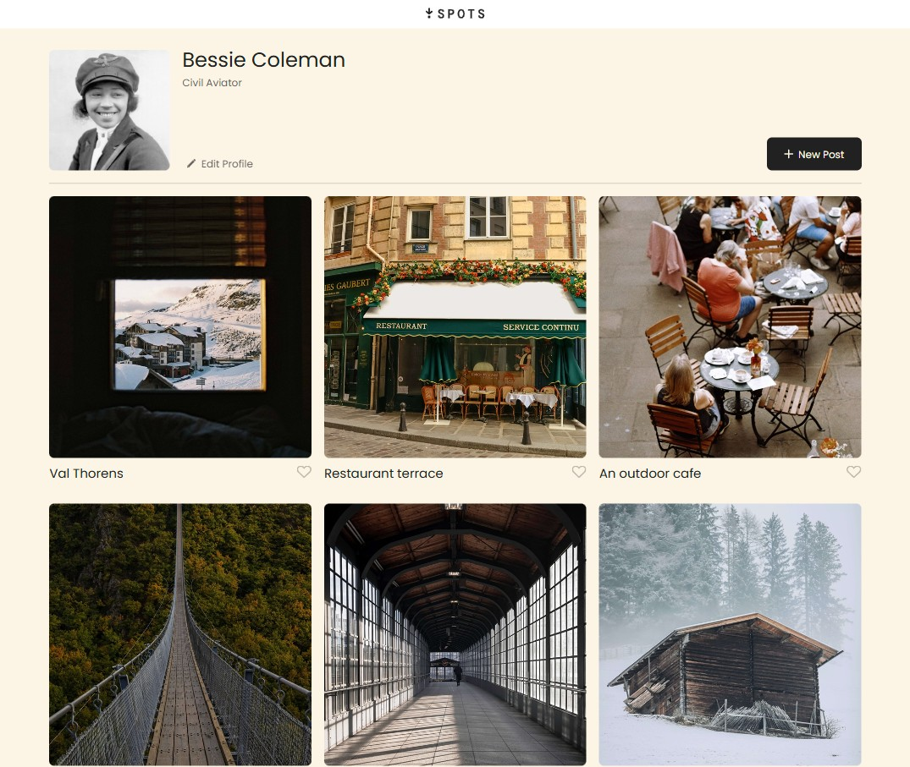

# My very first true responsive-design project with Triple Ten

My project for Sprint 3 at Triple Ten consisted in creating this tasteful digital art gallery. This webpage has a modest header, followed by a thorough profile dashboard. In the middle, the art gallery is displayed in a nice grid arrangement of three columns and two rows.

As the website adapts to smaller screens, the elements within will move, resize, and rearrange to comfortable layouts.

I consider this my first true responsive design, as it was tested with super wide screens, down to a width as narrow as 320px.

The website was designed according to the Figma's specifications, including icons and truncating text to avoid overflow.

### Link to my project:

https://josephrodriguez7.github.io/se_project_spots/

## Check my project's Demo:

## Functions and Specifications:

1. Header spans 100% of the website's width.
2. The main tag was given the "content" class. It has a constant padding of 20px on either side for a clean consistent look with different screen sizes.
3. The Profile dashboard is composed of a Card containing the user's avatar, profile name, profile description, and a edit profile button (with corresponding icon) with animations when hovered. Next to the card, a "new post" button was added.
4. Additionally, all buttons in this website have hover (with transition) effects and respective icons.
5. The "cards" section of the site contains a responsive grid. Starts as a three column and two row grid with responsive design. It maintains the 1:1 aspect ratio for the images throughout.
6. As the screen size narrows, the grid reduces to two columns in Tablet mode, then reduces to a single column in Mobile mode. The "justify-items" declaration was used to ensure elements placed within a grid cell remained centered.
7. The images within the cards are only reduced in size per Figma's requirement with screens 461px or smaller.

## Future Ideas and Improvements:

I would like to add real functionality to the "edit profile" and "new post" buttons. Most likely, I will revisit this project once I have learned Javascript, starting on Sprint 4.

Another thing I would like to add, is the "active" state to the like button. Perhaps as a full heart, not just the outline.

I hope this project is to your liking. Any feedback that helps me improve is most welcome!
